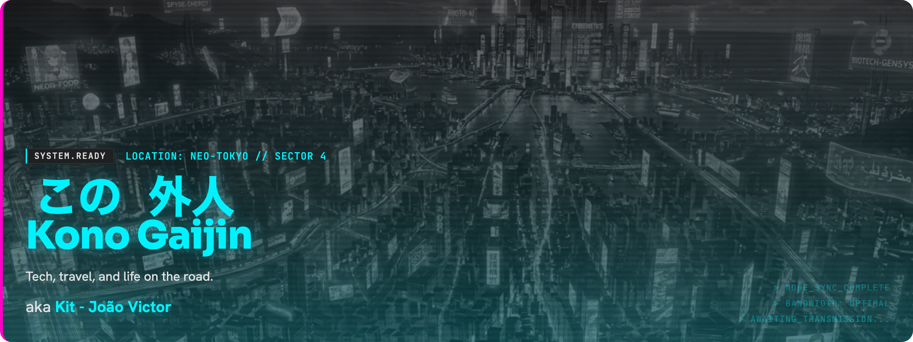
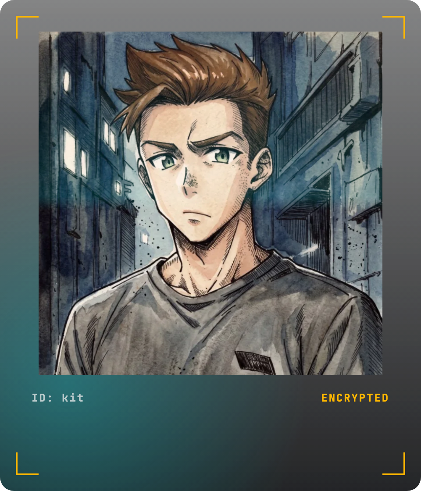
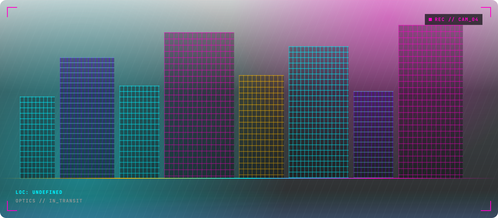
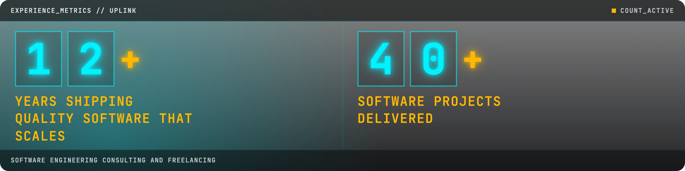

| TRANSMISSION_CHANNELS                                                                                                                                                                                                                                                                                                                                                                                                                                                                                                                                                                                                                                                              |                                                                         |
| ---------------------------------------------------------------------------------------------------------------------------------------------------------------------------------------------------------------------------------------------------------------------------------------------------------------------------------------------------------------------------------------------------------------------------------------------------------------------------------------------------------------------------------------------------------------------------------------------------------------------------------------------------------------------------------- | ----------------------------------------------------------------------- |
| Hi! I'm **João Victor Louro**, though most people call me **Kit**. I'm a Brazilian software engineer and a digital nomad. For 12+ years I've been shipping software that scales, mostly through consulting and freelance, and I write from wherever I happen to be.<br><br>I like living as an outsider — moving between countries, shipping from wherever I am. The public record lives on **[Kono Gaijin](https://konogaijin.com/)**, Japanese for "this foreigner."<br><br>I write about [travel, tech, and digital nomadism](https://konogaijin.com/en-us/articles/): how software actually gets built, and what it feels like to do that while you're in motion. The [portfolio](https://konogaijin.com/en-us/portfolio/) is the visual log. If you want to work together, I'm available for consulting and freelance — [say hello](https://konogaijin.com/en-us/about/). |  |







## CERTIFIED_QUALITY

`CREDENTIAL_SCAN // VERIFIED_CLEARANCE`

- **Google Project Management** — complete lifecycle, methodologies, documentation, and soft skills.
- **IBM Project Management** — in-demand skills and hands-on experience.
- **Agile / Scrum** — iterative delivery.
- **Software Engineering** — bachelor's degree.


## NETWORK_NODES

- [Kono Gaijin](https://konogaijin.com/en-us/)
- [Articles](https://konogaijin.com/en-us/articles/)
- [Portfolio](https://konogaijin.com/en-us/portfolio/)
- [About](https://konogaijin.com/en-us/about/)
- [Buy Me a Coffee](https://buymeacoffee.com/konogaijin)
- [Mail: contact@konogaijin.com](mailto:contact@konogaijin.com)
- [Mail: contact@joaovictor.com](mailto:contact@joaovictor.com)


## SYSTEM_LOG

```bsh
[STATUS] consulting uplink          AVAILABLE
[NODE]   location                   UNDEFINED
[SITE]   kono gaijin                ONLINE
[WORK]   12+ years · 40+ projects   VERIFIED
```

